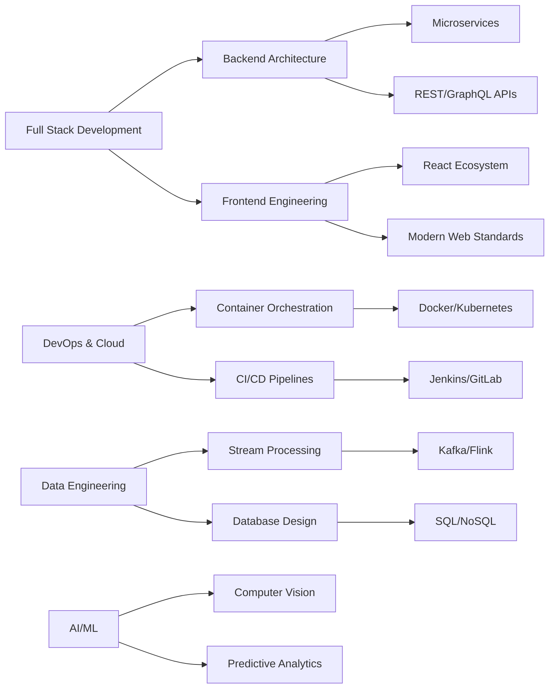

<div align="center">

#  Najid Mohamed

### Full Stack Architect | DevOps Engineer | Cloud Native Specialist

[](https://git.io/typing-svg)

<p align="center">
  <a href="mailto:najidmohamed2026@gmail.com"></a>
  <a href="https://linkedin.com/in/najid-mohamed-1075932b5"></a>
  <a href="https://github.com/NAJID-MOHAMED"></a>
  
</p>

```ascii
📍 Marrakech, Morocco  |  🌍 Building the Future of Cloud-Native Applications
```

</div>

---

## 💫 About

```typescript
const najid = {
    role: "Full Stack Architect & DevOps Engineer",
    location: "Marrakech, Morocco 🇲🇦",
    expertise: ["Microservices Architecture", "Cloud Native Solutions", "DevOps Automation"],
    
    currentFocus: [
        "Event-Driven Architecture with Kafka & Flink",
        "AI/ML Integration in Production Systems",
        "Zero-Downtime Deployment Strategies",
        "High-Performance Distributed Systems"
    ],
    
    philosophy: "Code is poetry, architecture is art, and DevOps is the science that brings them to life",
    
    certifications: {
        java: "Oracle Certified Java Developer",
        cloud: "AWS Cloud Practitioner",
        devops: "Oracle DevOps Professional",
        agile: "Scrum Alliance Agile PM"
    }
};
```

<details>
<summary><b>🎯 What I Bring to the Table</b></summary>
<br>

- 🏗️ **Architecture**: Design and implement scalable microservices architectures with event-driven patterns
- ☁️ **Cloud Native**: Build cloud-agnostic solutions leveraging AWS, containerization, and orchestration
- 🔄 **DevOps Excellence**: Implement CI/CD pipelines, infrastructure as code, and automated deployment strategies
- 🤖 **AI Integration**: Develop intelligent systems using machine learning for real-world business problems
- 📊 **Data Engineering**: Design real-time data processing pipelines with Kafka and Flink
- 🚀 **Performance**: Optimize systems for high throughput, low latency, and exceptional user experience

</details>

---

## 🛠️ Technology Arsenal

<table align="center">
<tr>
<td valign="top" width="33%">

### Backend & Architecture
```yaml
Languages:
  - Java (Spring Boot, Spring Cloud)
  - Python (Django, Flask, FastAPI)
  - Node.js (Express, NestJS)

Patterns:
  - Microservices Architecture
  - Event-Driven Design
  - CQRS & Event Sourcing
  - Domain-Driven Design
  - RESTful & GraphQL APIs
```

</td>
<td valign="top" width="33%">

### Frontend & Modern Web
```yaml
Frameworks:
  - React.js & Next.js
  - TypeScript
  - State Management (Redux, Zustand)
  
Design:
  - Responsive & Mobile-First
  - Component-Driven Development
  - Progressive Web Apps
  - Server-Side Rendering
```

</td>
<td valign="top" width="33%">

### DevOps & Cloud
```yaml
Cloud Platforms:
  - AWS (EC2, ECS, Lambda, S3)
  - Docker & Kubernetes
  
CI/CD:
  - Jenkins & GitLab CI
  - GitHub Actions
  - ArgoCD
  
IaC:
  - Terraform
  - Ansible
```

</td>
</tr>
<tr>
<td valign="top" width="33%">

### Data & Messaging
```yaml
Databases:
  - PostgreSQL (Advanced)
  - MongoDB
  - Redis (Caching & Pub/Sub)
  
Streaming:
  - Apache Kafka
  - Apache Flink
  - RabbitMQ
```

</td>
<td valign="top" width="33%">

### AI & Machine Learning
```yaml
Frameworks:
  - TensorFlow & PyTorch
  - Scikit-learn
  - FAISS (Vector Search)
  
Applications:
  - Computer Vision
  - NLP & Text Analysis
  - Recommendation Systems
  - Fraud Detection
```

</td>
<td valign="top" width="33%">

### Tools & Practices
```yaml
Monitoring:
  - Prometheus & Grafana
  - ELK Stack
  
Practices:
  - Agile/Scrum Methodologies
  - TDD & BDD
  - Code Review & Pair Programming
  - Clean Code Principles
```

</td>
</tr>
</table>

<div align="center">

### 📦 Tech Stack Visualization


</div>

---

## 📈 GitHub Analytics

<div align="center">
  


</div>

<div align="center">

[](https://git.io/streak-stats)

</div>

<div align="center">
  


</div>

---

## 🏆 Achievements & Recognition

<div align="center">

[](https://github.com/ryo-ma/github-profile-trophy)

</div>

---

## 🎓 Professional Certifications

<div align="center">

| 🏅 Certification | 🏢 Issuer | 🎯 Focus Area |
|:-----------------|:----------|:--------------|
| **Oracle Certified Java Developer** | Oracle | Enterprise Java Development |
| **AWS Cloud Practitioner** | Amazon Web Services | Cloud Architecture & Services |
| **Oracle DevOps Professional** | Oracle | CI/CD & Automation |
| **Scrum Alliance Agile PM** | Scrum Alliance | Agile Project Management |

</div>

---

## 💡 Core Competencies Matrix



---

## 🌟 Professional Philosophy

<div align="center">

> *"In the realm of software engineering, elegance lies not in the complexity of the solution,*  
> *but in the simplicity of the architecture that solves complex problems."*

</div>

### 🎯 My Approach

<table>
<tr>
<td width="50%">

#### 🏗️ **Architecture First**
- Design systems that scale horizontally
- Embrace cloud-native patterns
- Prioritize maintainability and extensibility
- Apply SOLID principles religiously

</td>
<td width="50%">

#### 🚀 **Automation Everything**
- Infrastructure as Code is non-negotiable
- CI/CD pipelines for rapid delivery
- Automated testing at every layer
- Monitoring and observability built-in

</td>
</tr>
<tr>
<td width="50%">

#### 💡 **Innovation Driven**
- Constantly exploring emerging technologies
- Integrating AI/ML for intelligent solutions
- Leveraging event-driven architectures
- Building for the future, not just today

</td>
<td width="50%">

#### 🤝 **Collaboration Focused**
- Clean, documented, and reviewable code
- Knowledge sharing and mentorship
- Agile methodologies for team efficiency
- Open source contribution mindset

</td>
</tr>
</table>

---

## 🔗 Let's Build Something Amazing

<div align="center">

### 💬 Open to Collaborations On

**Distributed Systems** • **Cloud Native Applications** • **AI/ML Integration** • **Open Source Projects** • **Microservices Architecture** • **DevOps Transformation**

<br>

[](mailto:najidmohamed2026@gmail.com)
[](https://linkedin.com/in/najid-mohamed-1075932b5)
[](https://github.com/NAJID-MOHAMED)

<br>

```javascript
// Let's turn ideas into reality
if (you.have("an interesting project") || you.need("technical expertise")) {
    reach.out("Let's discuss how we can build something extraordinary together");
}
```

---


**⚡ "Code with passion, architect with precision, deploy with confidence"** ⚡

</div>
